# HVAC-DT-EnergySim
A digital twin-based central air conditioning system energy consumption simulation platform. It should enable hourly annual energy simulations and optimize design solutions/control strategies under full-year operating conditions.

这是一个基于数字孪生的中央空调系统能耗仿真平台，能够空调系统全年逐时能耗仿真，并能够基于全年运行工况下，优化空调系统设计方案和控制策略。

## 一、建筑冷负荷模拟计算
### 1、建筑简介
  建筑类型属于商业办公建筑，六层，为了简化计算，地下层和屋顶没有设置空调，建筑地理位置是北京市，建筑空调面积2931m^2^。
### 2、建筑平面图
一层的建筑平面图：

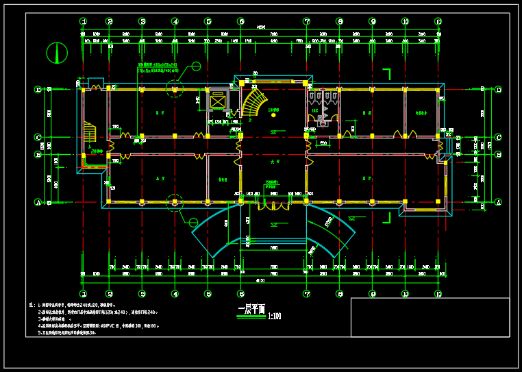

二层的建筑平面图：

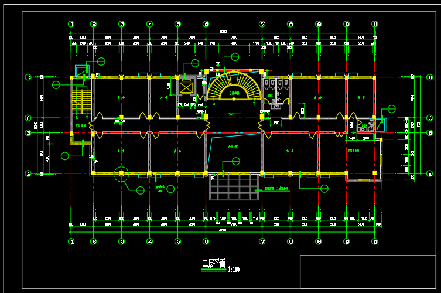

三层的建筑平面图：

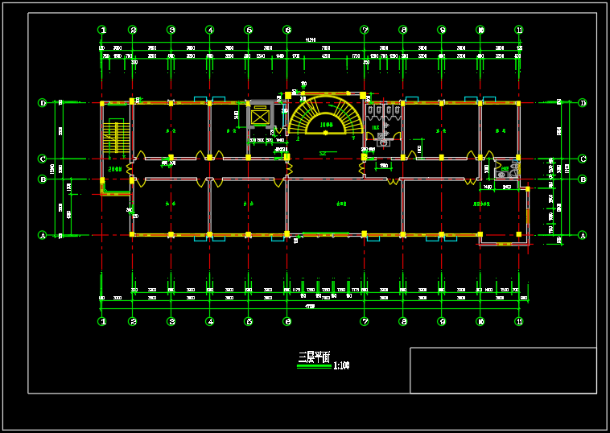

四、五层的建筑平面图：

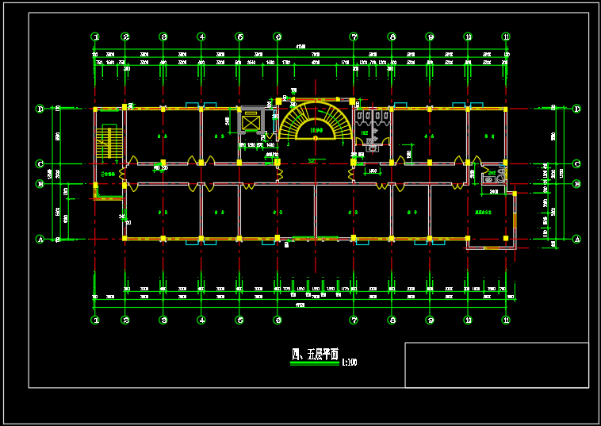

六层的建筑平面图：

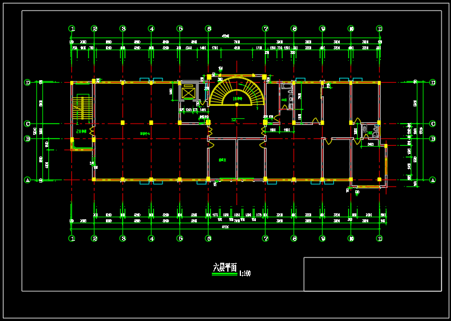

### 3、基于DeST软件的建筑模拟模型图
一层模型图：

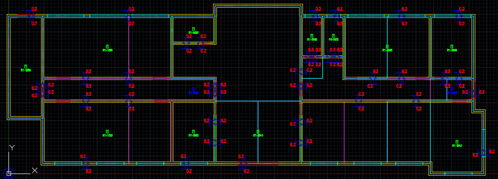

二层模型图：

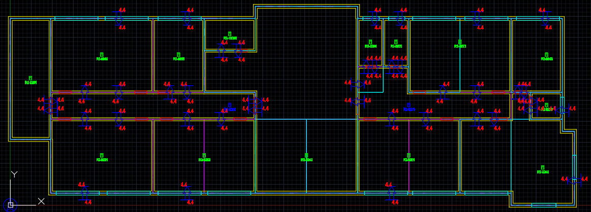

三层模型图：

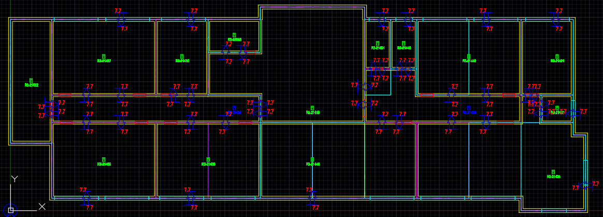

四、五层模型图：

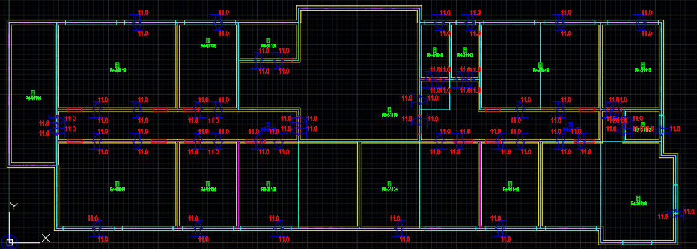

六层模型图：

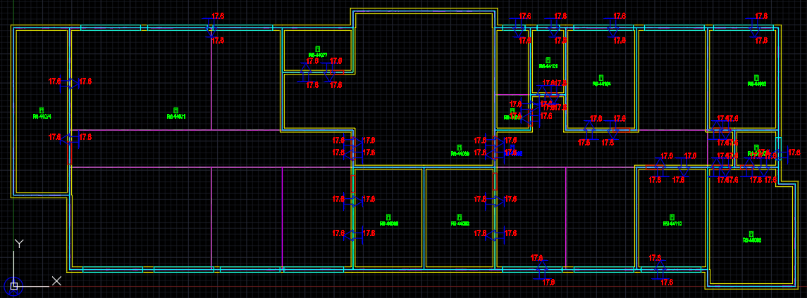

### 4、房间及围护结构设置
房间类型包括：楼梯间、展厅、大堂、密集办公室、办公室、设备间、休息室、卫生间等，房间作息和热扰均按照DeST软件内置参数，围护结构和门、窗等参数设置也是按照DeST软件内置参数。建筑模拟的全局设定如下图：

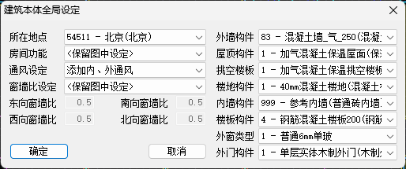

### 5、阴影和日影计算
使用DeST软件自带的阴影计算模块和日影计算模块进行全年的太阳辐射影响的计算，计算结果如下图：
1、5月22日 正午12时的阴影计算分析结果：

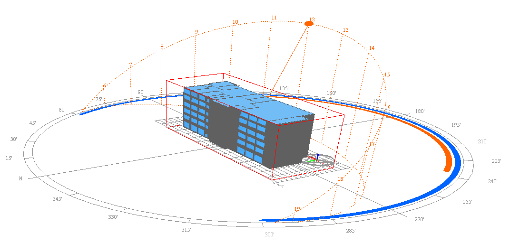

2、全年的阴影计算分析结果：

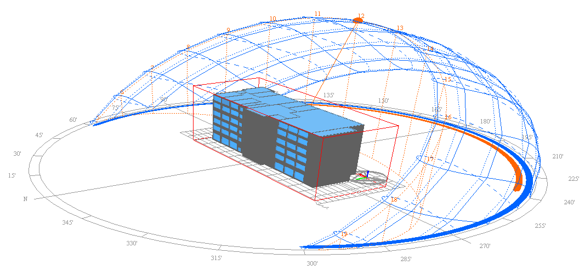

### 6、全年逐时冷负荷数据
以Excel文件的形式存放，全年冷/热负荷曲线图如下：
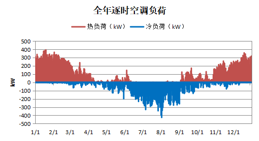
## 二、搭建离心式冷水机组模型
### 1、数据来源
建立离心式冷水机组物理模型，基于机组运行控制边界，获得机组运行工况边界约束，通过遍历所有工况参数，计算机组制冷量、COP、功率、蒸发温度、冷凝温度等性能参数，同时利用机组实际运行数据和实验室测试数据修正机组物理模型参数，获得机组最终数学模型，并进一步计算获得机组的全工况性能参数，为后续搭建机组机器学习模型做好准备。
### 2、冷冻水和冷却水温度范围
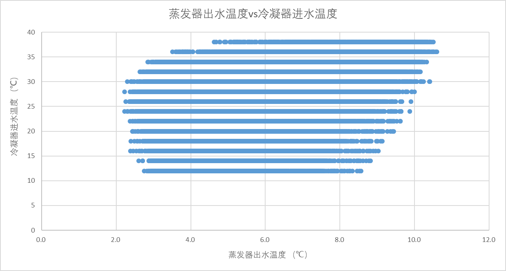
### 3、蒸发温度和冷凝温度范围
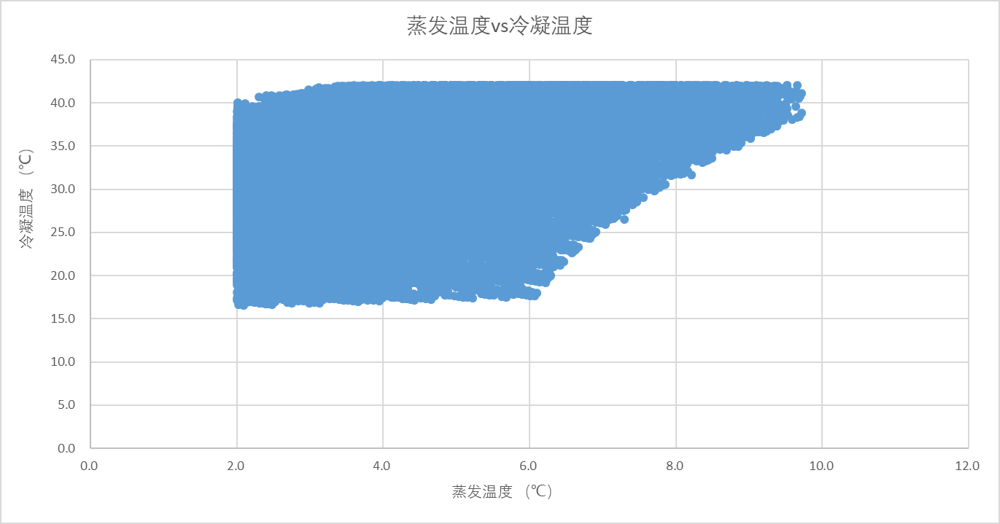
### 4、冷机部分负荷能效分布
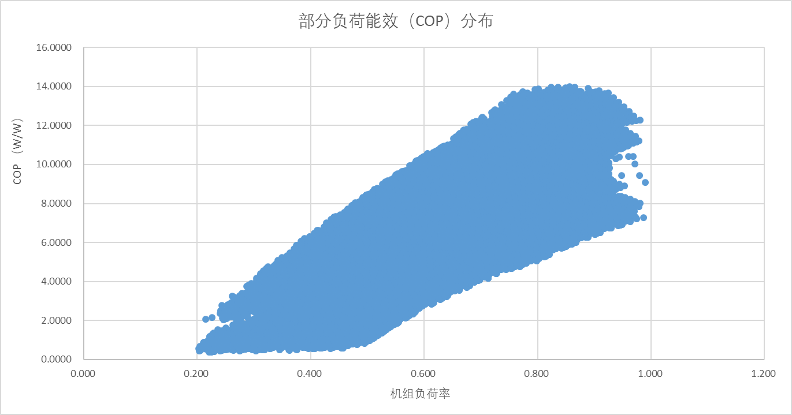